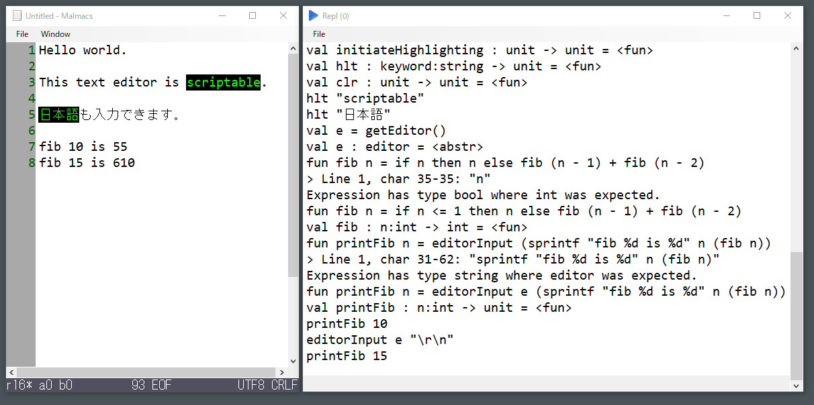

# Malmacs

A Programmable Text Editor for Windows.

## Introduction

Malmacs is a programmable text editor for Windows. It has common text editor UI similar to Notepad. And it features powerful script language interpreter.

The scripting language is [FsMiniMAL](https://github.com/nshibano/FsMiniMAL). It covers common language constructs of ML languages (OCaml, F#, etc.). The interpreter is specially designed to provide sandboxing functionality, thus, even if the running script contains bug and it crashes, the application doesn't crash and user doesn't lose the editing text data.

## Download

Download latest appveyor artifacts from [here](https://ci.appveyor.com/project/nshibano/malmacs/build/artifacts).

## Implementation details

Malmacs is implemented in F#.

## Licensing

Malmacs is MIT licensed.
